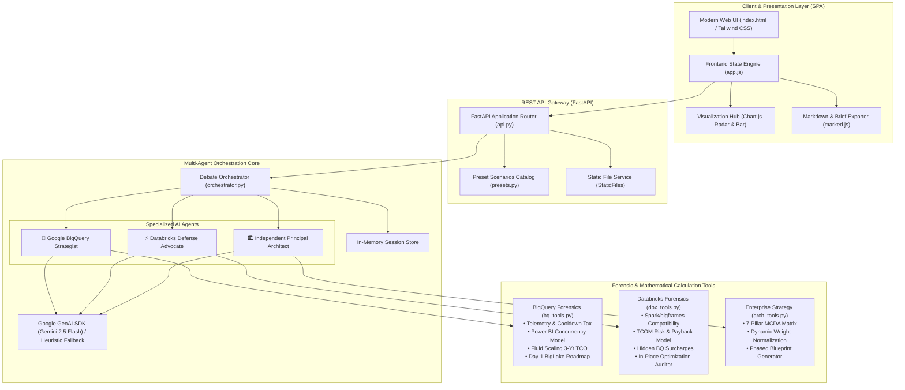
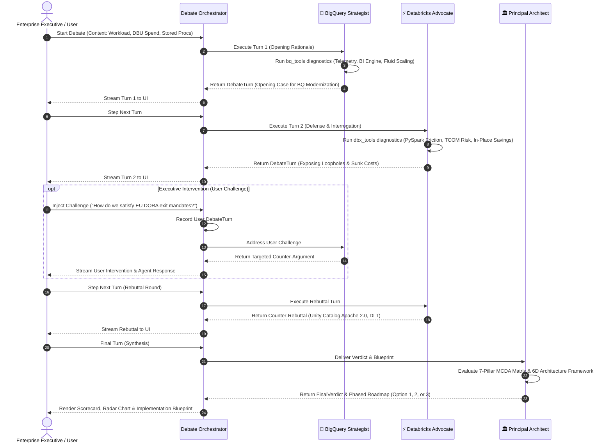

# 🏛️ Architecture Specification: BigQuery vs Databricks Strategic Debate Arena & Enterprise Arbiter

**Application:** `bq_dbx_debate`  
**Version:** `1.0.0`  
**System Classification:** Multi-Agent AI Orchestration, Simulation & Enterprise Architecture Decision Support System  

---

## 1. Executive Summary

The **BigQuery vs Databricks Strategic Debate Arena** is an autonomous multi-agent platform designed to model, simulate, and resolve high-stakes enterprise data architecture decisions. Rather than relying on static feature comparisons or sales pitches, the system establishes a dialectical confrontation between two specialized domain agents—the **Google BigQuery Migration Strategist** and the **Databricks Defense Advocate**—monitored, evaluated, and synthesized by an **Independent Principal Enterprise Architect & Arbiter**.

The architecture combines:
1. **Multi-Agent Turn Orchestration**: Deterministic yet LLM-augmented turn-taking with reactive user interventions.
2. **Forensic Calculation Engine**: Mathematical models quantifying telemetry waste, DAX query concurrency, PySpark codebase refactoring friction, Total Cost of Migration (TCOM), and hidden cloud fees.
3. **Multi-Criteria Decision Analysis (MCDA)**: A 7-pillar decision matrix dynamically weighted by customer context to recommend an actionable enterprise strategy.
4. **Interactive Single-Page Application (SPA)**: Real-time visual arena, diagnostic dashboards, Chart.js visualizations, and executive brief generator.

---

## 2. High-Level Component Topology

The platform is structured into four decoupled layers: Presentation (SPA), API & Gateway (FastAPI), Multi-Agent Core (Orchestrator & Agents), and Forensic Telemetry & Calculation Tools.



---

## 3. Multi-Agent Turn Sequence & Protocol

The debate operates as an alternating state machine with dynamic user intervention support.



---

## 4. Agent Specialization & Knowledge Specifications

### 4.1. 🚀 Google BigQuery Enterprise Migration Strategist
- **Core Mission**: Build an undeniable, evidence-backed architectural case for migrating off Databricks onto Google Cloud.
- **Architectural Pillars**:
  1. **BigQuery Fluid Scaling**: True per-second billing with **zero cooldown penalty** (`area-under-the-curve`), eliminating the legacy 60-second cluster scale-down tax and cutting spiky query costs by up to 97%.
  2. **Dataproc Serverless with Lightning Engine**: Native SIMD C++ vectorized execution runtime (**Apache Gluten & Velox**), delivering up to 2x faster performance than Databricks Photon at **$0 DBU software licensing fee**.
  3. **BigLake Zero-Copy Federation**: Day-1 in-place querying over Delta Lake / Apache Iceberg tables in Azure ADLS Gen2 or AWS S3 without data movement or downtime.
  4. **BigQuery BI Engine**: Sub-second in-memory DirectQuery caching (<500ms response time) eliminating DAX slot queuing in Power BI.
  5. **Capacitor Autonomous Storage**: Free automatic partitioning, clustering, and compaction, eliminating the 15–30% **Delta Maintenance Tax** (`OPTIMIZE`/`VACUUM`).

### 4.2. ⚡ Databricks Defense Advocate & Solutions Architect
- **Core Mission**: Interrogate BigQuery migration proposals, expose technical loopholes, quantify migration sunk costs (TCOM), and advocate for in-place optimization.
- **Architectural Pillars**:
  1. **The PySpark / `bigframes` Transpilation Trap**: `bigframes` translates strictly to SQL AST and fails on distributed RDDs (`mapPartitions`), Python UDFs, and custom MLlib pipelines, requiring hundreds of manual refactoring hours.
  2. **The "BigLake Zero-Copy" Latency Mirage**: External table queries across cloud boundaries lack native Photon C++ SIMD caching and incur heavy network egress penalties.
  3. **Total Cost of Migration (TCOM)**: Moving off Databricks triggers a 12–18 month engineering freeze, $1M+ in consulting rewrites, dual-run platform taxes, and talent attrition.
  4. **Hidden BigQuery Costs**: Storage Write API fees ($0.025/GB), dedicated BI Engine RAM ($30.36/GB/mo), and morning slot contention.
  5. **14-Day In-Place Optimization**: Serverless SQL, Photon Engine, Liquid Clustering, and Spot VM fleets cut OpEx by 40–50% immediately with zero migration risk.
  6. **Open Unity Catalog (Apache 2.0) & Delta UniForm**: Read Delta tables as Apache Iceberg/Hudi simultaneously without data duplication, ensuring full multi-cloud portability and EU DORA compliance.

### 4.3. 🏛️ Independent Principal Enterprise Architect (Arbiter)
- **Core Mission**: Maintain strict vendor neutrality and deliver a mathematically rigorous verdict based on a 6-Dimensional Enterprise Architecture Framework:
  1. *Conway's Law & Team Topologies*: Minimize cognitive load and protect data science developer velocity.
  2. *M&A Ingestion Agility*: Speed of onboarding acquired hospital/subsidiary systems across heterogeneous clouds.
  3. *Storage Decoupling & Sovereignty*: Mandate open table standards (Iceberg/UniForm) for regulatory exit readiness (EU DORA / EHDS).
  4. *Technical Debt Modernization*: Decompose legacy stored procedures into modular domain data products.
  5. *AI & GenAI Enablement*: Support in-situ SQL multimodal querying alongside distributed MLflow deep learning.
  6. *Net Capital Efficiency & 5-Year TCO*: Balance upfront TCOM vs in-place optimization ROI.

---

## 5. Forensic Mathematical Models & Formulas

### 5.1. Databricks Telemetry & Waste Forensics (`bq_tools.py`)
$$\text{Total Spend} = \text{Annual DBU Spend} \times \text{VM Markup Multiplier (1.35)}$$
$$\text{Idle Waste} = \text{Annual DBU Spend} \times 0.40 \times \text{Idle Pct (0.35)} \times 1.35$$
$$\text{Delta Maintenance Tax} = \text{Annual DBU Spend} \times 0.18 \times 1.35$$
$$\text{OOM Recovery Waste} = \text{PySpark Jobs} \times 12 \times \$85.00$$

### 5.2. Power BI Concurrency & Slot Queuing Model (`bq_tools.py`)
$$\text{Simultaneous DAX Queries} = \text{Concurrent Users} \times 0.60$$
$$\text{Queue Ratio} = \max\left(1.0, \frac{\text{Simultaneous DAX}}{\text{Warehouse Slots}}\right)$$
$$\text{Databricks Load Time} = 3.8\text{s} \times \text{Queue Ratio}$$
$$\text{BigQuery BI Engine Load Time} = 0.45\text{s} \quad (\text{Sub-second in-memory acceleration})$$

### 5.3. PySpark Codebase Refactoring Burden (`dbx_tools.py`)
$$\text{Rewrite Hours} = (N_{\text{udf}} \times 8\text{h}) + (N_{\text{rdd}} \times 14\text{h}) + (N_{\text{dlt}} \times 24\text{h}) + (N_{\text{ml}} \times 20\text{h}) + \left(\frac{N_{\text{jobs}}}{2} \times 3\text{h}\right)$$
$$\text{Refactoring Consulting Cost} = \text{Rewrite Hours} \times \$175.00/\text{hr}$$

### 5.4. Total Cost of Migration (TCOM) (`dbx_tools.py`)
$$\text{Dual-Run Tax} = \left(\frac{\text{Annual Spend}}{12}\right) \times 12\text{ mo} \times 0.40$$
$$\text{Egress \& Validation} = \text{Storage TB} \times 1024 \times \$0.02 \times 1.5$$
$$\text{TCOM} = \text{Refactoring Cost} + \text{Dual-Run Tax} + \text{Egress \& Validation} + \text{Team Retraining (\$120k)}$$

### 5.5. Multi-Criteria Decision Analysis (MCDA) (`arch_tools.py`)
Dynamic weight assignment normalized to $1.0$:
$$W_i = \frac{w_i}{\sum_{j=1}^{7} w_j}$$
Composite Score for Option $k \in \{\text{Option 1, Option 2, Option 3}\}$:
$$S_k = \sum_{i=1}^{7} \left( \text{Score}_{k, i} \times W_i \right)$$

---

## 6. Data Schema Hierarchy (`app/models/schemas.py`)

```
EnterpriseContext
├── enterprise_name: str
├── industry: str
├── annual_dbu_spend: float
├── storage_tb: float
├── total_pyspark_jobs: int
├── lines_of_code: int
├── mlflow_models_count: int
├── streaming_pipelines_count: int
├── powerbi_users_count: int
├── legacy_stored_procs: int
├── m_and_a_acquisitions_per_year: int
├── primary_cloud: str
├── cloud_strategy: str
├── regulatory_framework: str
├── current_pain_points: List[str]
└── strategic_priorities: List[str]

DebateSession
├── session_id: str (UUID)
├── created_at: ISO-8601 Timestamp
├── context: EnterpriseContext
├── total_rounds: int
├── current_round: int
├── status: "initialized" | "in_progress" | "completed" | "error"
├── turns: List[DebateTurn]
│   ├── turn_id: str
│   ├── round_number: int
│   ├── speaker: "bigquery_strategist" | "databricks_advocate" | "principal_architect" | "user"
│   ├── speaker_display_name: str
│   ├── speaker_role: str
│   ├── avatar: str
│   ├── stance: str
│   ├── content: str (Markdown)
│   ├── key_arguments: List[str]
│   ├── tool_data: Dict[str, Any]
│   └── citations: List[str]
└── final_verdict: Optional[FinalVerdict]
    ├── recommended_strategy_title: str
    ├── recommended_option_key: str
    ├── executive_summary: str
    ├── mcda_matrix: MCDAScore (weights, scores_by_option, weighted_totals)
    ├── key_tradeoffs: List[str]
    ├── financial_impact_summary: Dict[str, Any]
    ├── phased_roadmap: List[PhasedRoadmapStep]
    └── architectural_principles: List[str]
```

---

## 7. REST API Endpoints Specification

| Method | Endpoint | Description | Request Body | Response |
| :--- | :--- | :--- | :--- | :--- |
| `GET` | `/api/presets` | List preset enterprise scenarios | None | `Dict[str, EnterpriseContext]` |
| `POST` | `/api/debate/start` | Start debate session | `StartDebateRequest` | `DebateSession` |
| `POST` | `/api/debate/step` | Execute next logical turn | `StepDebateRequest` | `{"turn": DebateTurn, "session": DebateSession, "is_completed": bool}` |
| `POST` | `/api/debate/run-all` | Run all turns to completion | `StepDebateRequest` | `DebateSession` |
| `POST` | `/api/debate/intervene` | Inject user prompt & get response | `InterveneDebateRequest` | `{"user_turn": DebateTurn, "agent_turn": DebateTurn, "session": DebateSession}` |
| `GET` | `/api/debate/{id}` | Get session details | None | `DebateSession` |
| `POST` | `/api/tools/diagnostics` | Execute all forensic tools | `EnterpriseContext` | `{"bigquery_forensics", "databricks_forensics", "mcda_matrix"}` |
| `GET` | `/api/export/markdown/{id}` | Export Markdown report | None | `text/plain` |
| `GET` | `/api/export/json/{id}` | Export full session JSON | None | `application/json` |
| `GET` | `/api/health` | Service health check | None | `{"status": "healthy", "service": "...", "version": "1.0.0"}` |

---

## 8. Frontend Single-Page Application (SPA)

The user interface is implemented in standards-compliant HTML5, Tailwind CSS, and Vanilla ES6+ JavaScript, ensuring zero build-step overhead and high responsiveness:

1. **Top Stage Visualizer**: 3-Agent stage with real-time CSS glowing ring animations that pulsate around whichever agent is currently speaking.
2. **Debate Transcript Feed**: Rendered with `marked.js`, featuring syntax highlighting, key argument pills, citations, and expandable forensic telemetry details.
3. **Forensics Dashboard**: Tabbed interface powered by **Chart.js**:
   - *MCDA Radar Chart*: 7 enterprise pillars comparison.
   - *TCO Bar Chart*: Dual-billing vs BigQuery Editions vs In-Place Optimization.
   - *Power BI Concurrency Simulator*: Interactive slider dynamically updating DAX queuing risk and load times.
   - *Spark Incompatibility Table*: Detailed breakdown of UDF and RDD refactoring hours.
   - *Phased Blueprint Viewer*: Timeline roadmap with deliverables and risk mitigations.
4. **User Intervention Drawer**: Modal with 1-click preset challenge chips and custom executive text input.
5. **Executive Export System**: 1-click Markdown file download, JSON session export, clipboard copy, and print-to-PDF formatting.

---

## 9. Security, Privacy & Compliance Architecture

1. **Zero Data Ingestion of Customer IP**: The application operates exclusively on metadata and aggregate workload metrics (DBU spend, table volume, job counts, LOC). No raw proprietary data or production databases are accessed.
2. **Strict LLM Isolation & Fallback**: The agent architecture integrates Google GenAI SDK with structured fallback synthesis, ensuring 100% offline availability and zero sensitive data leakage.
3. **EU DORA & Multi-Cloud Readiness**: The system embeds multi-cloud exit strategy requirements into its core MCDA matrix to ensure compliance with financial and healthcare data sovereignty mandates.
